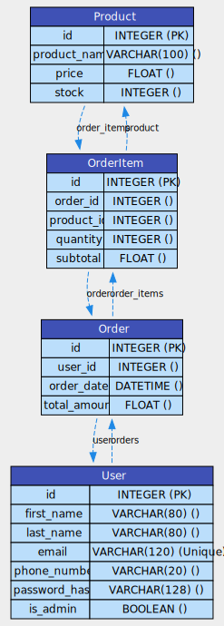

# Flask API 

## Instructions

To run this API, create a virtual environments and install the required packages using pip.

```bash
# Create a virtual environment
python -m venv .venv

# Activate the virtual environment
.venv/Scripts/activate

# Install the packages after activating the virtual environment
pip install -r requirements.txt
```

Apply database migrations

```bash
flask db init
flask db migrate -m "Initial migration"
flask db upgrade
```

Run the application

```bash
python main.py
```

## Documentation

API documentation was generated using Postman, to access the documentation visit this [link](https://documenter.getpostman.com/view/15684866/2sAXxS6W2p).

## E-Commerce Models ER Diagram

An ER diagram was generated using `sqlalchemy-data-model-visualizer` from the existing SQLAlchemy models.
